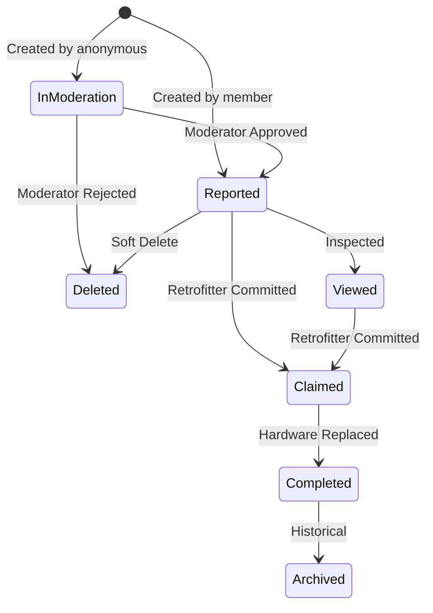

# TABVAR API Authentication & Client Onboarding Guide

Authoritative guide for authenticating external clients, 3rd-party platforms, and backend services with the TABVAR v1 API suite.

---

## 1. Architecture Overview

TABVAR APIs use **Bearer Token Authentication**. Every API request must supply a token in the HTTP `Authorization` header:

```http
Authorization: Bearer <token>
```

### Security & Token Storage
* **Hashing**: Tokens are never stored in plaintext. The server computes a SHA-256 digest of the token (`token_hash`) and validates incoming requests against the `api_token` database table.
* **User Identity**: Every token is tied to a specific TABVAR user account (`uid`). The caller inherits that user's role and display name.
* **Client Identification**: Every token records a `client` string (e.g. `"topobuilder"`, `"sendage-sync"`, `"crag-bot"`). This isolates offline delta sync references (`externalId`) and enables granular audit logging.
* **Activity Tracking**: The server automatically updates the token's `last_used_at` timestamp (throttled to at most once every 24 hours to prevent write amplification).

---

## 2. Roles & Permissions Matrix

TABVAR enforces role-based access control (RBAC) at the API layer. The caller's role is determined by the linked user account:

| Capability | Anonymous (`anonymous`) | Member (`member`) | Admin / Super (`admin`, `super`) |
| :--- | :---: | :---: | :---: |
| **Pull Routes, Crags, Sectors** | ✅ Full access | ✅ Full access | ✅ Full access |
| **Pull Public Issues** | ✅ Full access | ✅ Full access | ✅ Full access |
| **Report New Issue** | ✅ Forced to `In Moderation` | ✅ Any status (`Reported`, etc.) | ✅ Any status |
| **Upload Issue Photos** | ✅ To own reported issue | ✅ To any issue | ✅ To any issue |
| **Edit Issue Content** | ❌ 403 Forbidden | ✅ Full access | ✅ Full access |
| **Change Issue Status** | ❌ 403 Forbidden | ✅ Full access (`Claimed`, `Completed`, etc.) | ✅ Full access |
| **Soft-Delete Issue** | ❌ 403 Forbidden | ✅ Full access | ✅ Full access |
| **Save / Delete Topos** | ❌ 403 Forbidden | ✅ Full access | ✅ Full access |

### The `anonymous` Role Workflow
* Third parties that allow unauthenticated or guest users to submit bolt reports should use tokens linked to `anonymous` users.
* New issues filed by `anonymous` callers **must** have `status: "In Moderation"`.
* Issues in moderation are automatically analyzed by Google Gemini AI for quality and spam checks, then queued for human review by TABVAR moderators before appearing publicly.

---

## 3. Client Onboarding & Authentication Flows

Depending on whether your integration is an interactive mobile/web application or an automated backend service, choose the appropriate flow:

```mermaid
graph TD
    subgraph FlowA["Flow A: Interactive User App"]
        A1[User taps 'Connect TABVAR'] --> A2[Browser opens /connect/:client]
        A2 --> A3[User signs in via Google OAuth]
        A3 --> A4[Server redirects to return_to with short-lived Ticket]
        A4 --> A5[App exchanges Ticket for Bearer Token via POST]
        A5 --> A6[App stores Bearer Token securely]
    end

    subgraph FlowB["Flow B: Server-to-Server / Backend Service"]
        B1[Developer requests integration] --> B2[Admin creates Service Token]
        B2 --> B3[Token stored in secure secrets manager]
        B3 --> B4[Backend includes Bearer token in automated jobs]
    end
```



### Flow A: Interactive App Connect Flow (Recommended for Mobile/Web Apps)

This flow allows users of external apps (like TopoBuilder or guidebook apps) to authenticate their personal TABVAR account.

#### Step 1: Redirect User to Connect Endpoint
Direct the user's webview or system browser to the connect endpoint with an allowlisted `return_to` callback:

```
GET https://tabvar.org/connect/topobuilder?return_to=myapp://auth/callback
```

1. If the user is not signed in to TABVAR, they are prompted to sign in with Google.
2. The server verifies that `return_to` is on the configured allowlist.
3. The server generates a single-use connection ticket (`tb_ticket_...`) with a **5-minute expiration**.
4. The server redirects the user back to your application:
   ```
   myapp://auth/callback?ticket=tb_ticket_3fa85f64...
   ```

#### Step 2: Exchange Ticket for Bearer Token
From your app's background network service, make an immediate `POST` request to complete the connection:

```http
POST /api/topobuilder/connect/complete
Content-Type: application/json

{
  "ticket": "tb_ticket_3fa85f64..."
}
```

#### Step 3: Store the Token Securely
**Response `200 OK`:**
```json
{
  "token": "tb_token_8a7d3e2f...",
  "user": {
    "uid": "google-oauth2|1092837465",
    "displayName": "Jane Climber",
    "email": "jane@example.com",
    "role": "member"
  }
}
```
* Store `token` in secure device storage (iOS Keychain, Android EncryptedSharedPreferences).
* Pass `token` on every subsequent API call.
* Tickets are single-use and invalid after redemption.

---

### Flow B: Machine / Service Tokens (Server-to-Server)

For backend daemons, batch data sync scripts, or external platforms:

1. **Requesting Provisioning**: Contact TABVAR administrators with your application name, target crags/use case, and required role.
2. **Provisioning**: An administrator generates an unexpiring or long-lived token directly in the `api_token` table:
   ```sql
   INSERT INTO api_token (id, uid, client, name, token_hash, expires_at)
   VALUES (
     'uuid-v4',
     'service-user-uid',
     'my-platform-client-id',
     'MyPlatform Sync Bot',
     '<sha256-hex-hash>',
     NULL
   );
   ```
3. **Storage**: Store the token in your backend secrets management system (e.g. AWS Secrets Manager, Cloudflare Secrets, Doppler).

---

## 4. Origin & CORS Policies

If calling TABVAR APIs from a browser-based SPA or custom client:

* **Origin Allowlist**: Cross-Origin Resource Sharing (CORS) is restricted to registered domains and app protocols configured in `TOPOBUILDER_RETURN_TO_ALLOWLIST` / `DEFAULT_ORIGIN_ALLOWLIST`.
* **Standard Supported Schemes**:
  * Production: `topobuilder:` custom URL scheme.
  * Local Development: `exp:`, `http://localhost:8081`, `http://localhost:19006`, `http://127.0.0.1:8081`.
* **Adding Your Origin**: Contact TABVAR administrators to add your web domain (e.g. `https://myclimbingapp.com`) or mobile scheme to the production environment.
* **Preflight**: Always handle `OPTIONS` requests if building an SDK or custom client wrapper.

---

## 5. Issue Taxonomy & Allowed Values

When creating or modifying issues via `/api/v1/issues/sync`, values **must** conform to TABVAR's fixed hardware domain model:

### Allowed Issue Types & Sub-Issue Types

| Issue Type (`issueType`) | Permitted Sub-Issue Types (`subIssueType`) |
| :--- | :--- |
| **`Bolts`** | `Loose nut`, `Loose bolt`, `Loose glue-in`, `Rusted`, `Outdated`, `Worn`, `Missing (bolt and hanger)`, `Missing (hanger)`, `Other` |
| **`All Bolts`** | *(Same as `Bolts`)* |
| **`Anchor`** | *(Same as `Bolts`)* |
| **`Rock`** | `Loose block`, `Loose flake`, `Other` |

### Issue Status Life Cycle



* **Public vs. Hidden**: The statuses `In Moderation`, `Completed`, `Archived`, and `Deleted` are hidden from public crag topo views.
* **Moderation Metadata**: When an issue is moved to `Reported`, `approvedAt` and `approvedByUid` are set. When marked `Completed` or `Archived`, `archivedAt` and `archivedByUid` are set.

---

## 6. Error Handling & Standard Responses

All API endpoints return errors in a standardized JSON envelope:

```json
{
  "error": "<error_code>",
  "message": "Human-readable explanation."
}
```

### Error Code Reference

| Status Code | Error Code (`error`) | Typical Cause |
| :---: | :--- | :--- |
| **400** | `bad_request` | Missing required payload field (e.g. missing `routeId` or `issueType`). |
| **401** | `invalid_token` | Missing, expired, or revoked Bearer token. |
| **401** | `invalid_ticket` | Connection ticket expired (older than 5 minutes) or already used. |
| **403** | `forbidden` | Role lacks permission (e.g. anonymous user attempting to edit or delete). |
| **404** | `not_found` | Target route ID, crag ID, or issue ID does not exist. |
| **405** | `method_not_allowed` | Incorrect HTTP method used (e.g. `POST` instead of `GET`). |
| **409** | `conflict` | **Server-wins conflict**: Incoming `baseUpdatedAt` is older than the server's current record. |

---

## 7. Related Documentation

* [issue-sync-api.md](file:///x:/Documents/GitHub/tabvar/docs/issue-sync-api.md): Full specification for pulling and pushing issues and photo attachments.
* [route-sync-api.md](file:///x:/Documents/GitHub/tabvar/docs/route-sync-api.md): Specification for pulling crag, sector, and route catalogs.
* [topo-sync-api.md](file:///x:/Documents/GitHub/tabvar/docs/topo-sync-api.md): Specification for synchronizing visual topos and SVG annotations.
