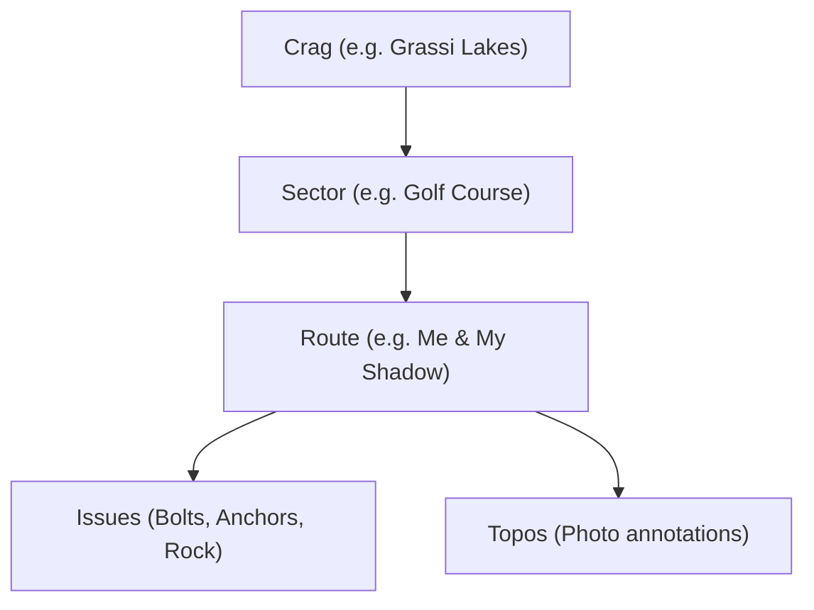

# TABVAR Route & Hierarchy Sync API (v1)

Data synchronization specification for Crags, Sectors, and Routes between TABVAR and external clients (e.g. mobile applications, 3rd-party climbing databases, and stewardship platforms).

All endpoints in this specification support incremental delta synchronization via a `since` timestamp cursor.

---

## Authentication & Headers

All requests require a Bearer token in the `Authorization` header:

```http
Authorization: Bearer <token>
```

Tokens may be issued to `anonymous`, `member`, `admin`, or `super` users. All active tokens have read access to crags, sectors, and routes.

For detailed token provisioning, roles, and error specifications, see [api-auth-and-onboarding.md](file:///x:/Documents/GitHub/tabvar/docs/api-auth-and-onboarding.md).

### CORS & Preflight
All endpoints respond to `OPTIONS` preflight requests with CORS headers when invoked from an allowlisted origin.

### Timestamp Format
Timestamps in request parameters and responses use the SQLite UTC format:
```
YYYY-MM-DD HH:MM:SS
```

---

## Domain Hierarchy & Identity

TABVAR organizes climbing data in a three-tier hierarchy:



* **Numeric IDs**: All entities standardize on auto-incrementing integer IDs (`id: number`).
* **Foreign Keys**: Routes link directly to their parent sector via `sectorId` and crag via `cragId`. Sectors link to crags via `cragId`.
* **Issues & Topos**: Fixed hardware issues and topos are route-scoped and require a valid `routeId`.

---

## 1. Pull Crags

```http
GET /api/v1/crags
GET /api/v1/crags?since=<cursor>
```

Retrieves climbing crags / areas.

### Query Parameters

| Parameter | Type | Required | Description |
| :--- | :--- | :--- | :--- |
| `since` | String | No | A `serverTime` cursor from a previous pull. Omit for a full pull. |

### Sorting Behavior
* **With `since`**: Sorted by `crag.updated_at ASC, crag.id ASC`.
* **Without `since`**: Sorted alphabetically by `crag.name ASC`.

### Response `200 OK`

```json
{
  "crags": [
    {
      "id": 1,
      "name": "Grassi Lakes",
      "slug": "grassi-lakes",
      "latitude": 51.0664,
      "longitude": -115.4052,
      "notes": "Popular sport crag near Canmore. Helmets recommended.",
      "statsActiveIssueCount": 2,
      "statsIssueFlagged": 0,
      "statsPublicIssueCount": 2,
      "createdAt": "2026-01-10 12:00:00",
      "updatedAt": "2026-06-01 15:30:00",
      "attachments": []
    }
  ],
  "serverTime": "2026-06-01 15:30:00"
}
```

#### Field Glossary
* `id` *(number)*: Unique integer ID.
* `name` *(string)*: Crag display name.
* `slug` *(string | null)*: URL-friendly identifier used in web routes.
* `latitude` / `longitude` *(number | null)*: WGS84 GPS coordinates.
* `statsActiveIssueCount` *(number | null)*: Total non-closed issue count.
* `statsIssueFlagged` *(number | null)*: Count of flagged/urgent issues.
* `statsPublicIssueCount` *(number | null)*: Issues visible on public route cards.
* `attachments` *(array)*: Area-level topo overviews or approach maps.

---

## 2. Pull Sectors

```http
GET /api/v1/sectors
GET /api/v1/sectors?since=<cursor>
```

Retrieves sectors / walls within crags.

### Query Parameters

| Parameter | Type | Required | Description |
| :--- | :--- | :--- | :--- |
| `since` | String | No | A `serverTime` cursor from a previous pull. Omit for a full pull. |

### Sorting Behavior
* **With `since`**: Sorted by `sector.updated_at ASC, sector.id ASC`.
* **Without `since`**: Sorted by `sector.crag_id ASC, sector.sort_order ASC, sector.name ASC`.

### Response `200 OK`

```json
{
  "sectors": [
    {
      "id": 12,
      "cragId": 1,
      "name": "Golf Course",
      "latitude": 51.0671,
      "longitude": -115.4061,
      "notes": "Sunny wall with slab to vertical climbing.",
      "sortOrder": 1,
      "createdAt": "2026-01-10 12:10:00",
      "updatedAt": "2026-05-20 09:15:00",
      "attachments": []
    }
  ],
  "serverTime": "2026-05-20 09:15:00"
}
```

#### Field Glossary
* `id` *(number)*: Sector primary key.
* `cragId` *(number | null)*: Reference to parent `crag.id`.
* `name` *(string)*: Wall / sector name.
* `sortOrder` *(number | null)*: Left-to-right display order along the cliff.

---

## 3. Pull Routes

```http
GET /api/v1/routes
GET /api/v1/routes?since=<cursor>
```

Retrieves climbing routes across all crags and sectors.

### Query Parameters

| Parameter | Type | Required | Description |
| :--- | :--- | :--- | :--- |
| `since` | String | No | A `serverTime` cursor from a previous pull. Omit for a full pull. |

### Sorting Behavior
* **With `since`**: Sorted by `route.updated_at ASC, route.id ASC`.
* **Without `since`**: Sorted by `crag_id ASC, sector_id ASC, sort_order ASC, name ASC`.

### Response `200 OK`

```json
{
  "routes": [
    {
      "id": 456,
      "cragId": 1,
      "sectorId": 12,
      "name": "Me & My Shadow",
      "altNames": "Shadow",
      "gradeYds": "5.10b",
      "status": "Active",
      "latitude": 51.0672,
      "longitude": -115.4063,
      "notes": "Crux is between bolt 2 and 3.",
      "sortOrder": 4,
      "boltCount": 6,
      "pitchCount": 1,
      "routeLength": 22,
      "climbStyle": "Sport",
      "year": 1998,
      "routeBuiltDate": "1998-07-15",
      "firstAscentBy": "Andy Genereux",
      "firstAscentDate": "1998-07",
      "cragName": "Grassi Lakes",
      "sectorName": "Golf Course",
      "createdAt": "2026-01-10 12:30:00",
      "updatedAt": "2026-06-09 10:00:00",
      "attachments": []
    }
  ],
  "serverTime": "2026-06-09 10:00:00"
}
```

#### Field Glossary
* `id` *(number)*: Route primary key. **Use this ID when reporting issues via `/api/v1/issues/sync` or linking topos.**
* `cragId` / `sectorId` *(number | null)*: Parent references.
* `name` *(string)*: Primary route name.
* `altNames` *(string | null)*: Alternative or historical names.
* `gradeYds` *(string | null)*: Grade in Yosemite Decimal System (`5.0` to `5.15b`).
* `status` *(string | null)*: Route status (e.g. `"Active"`, `"Project"`, `"Decommissioned"`).
* `climbStyle` *(string | null)*: Discipline (`"Sport"`, `"Trad"`, `"Boulder"`, `"Ice/Mixed"`, `"Aid"`).
* `boltCount` *(number | null)*: Number of protection bolts (excluding anchor bolts).
* `pitchCount` *(number | null)*: Number of pitches.
* `routeLength` *(number | null)*: Length in meters.
* `firstAscentBy` / `firstAscentDate` *(string | null)*: FA history.
* `cragName` / `sectorName` *(string | null)*: Denormalized parent names for convenient UI rendering.

---

## Delta Synchronization Workflow

Clients should implement an incremental sync pattern to stay up-to-date while minimizing bandwidth:

```mermaid
sequenceDiagram
    participant Client
    participant TABVAR as TABVAR API

    Note over Client: Initial Full Pull (Cold Start)
    Client->>TABVAR: GET /api/v1/crags
    TABVAR-->>Client: { crags, serverTime: T1 }
    Client->>TABVAR: GET /api/v1/sectors
    TABVAR-->>Client: { sectors, serverTime: T2 }
    Client->>TABVAR: GET /api/v1/routes
    TABVAR-->>Client: { routes, serverTime: T3 }
    Note over Client: Store records and save cursors T1, T2, T3

    Note over Client: Incremental Sync (Subsequent Runs)
    Client->>TABVAR: GET /api/v1/routes?since=T3
    TABVAR-->>Client: { routes: [modified_or_new], serverTime: T4 }
    Note over Client: Upsert changed records by id; update cursor to T4
```

### Delta Rules
1. **Inclusive Comparison**: The server checks `updated_at >= since`. Any records modified in the boundary second are returned again. Clients must dedupe / upsert records by `id`.
2. **Cursor Persistence**: Store the `serverTime` returned by the server, not the client's local system clock.
3. **Soft Deletions**: If a route or sector is removed or decommissioned, its `status` is updated (e.g. `status: "Deleted"` or `"Decommissioned"`), and `updated_at` is touched. Clients should update or purge accordingly.

---

## Route Matching & Resolution for 3rd Parties

When integrating 3rd-party climbing apps (such as logging ticklists or importing crag guides):

1. **Mapping by IDs**: Store TABVAR's `route.id` alongside your internal route ID.
2. **Matching by Composite Keys**: If matching existing routes without TABVAR IDs, match on:
   * Normalized Crag Name + Sector Name + Route Name + `gradeYds`.
3. **Route Search Endpoint**: Clients can also perform fuzzy text search against routes using the search endpoint:
   ```http
   GET /api/search?q=Me+and+My+Shadow
   ```
4. **Creating Missing Routes**: If an issue needs to be filed for an unlisted route, routes can be submitted through the Topo API ([topo-sync-api.md](file:///x:/Documents/GitHub/tabvar/docs/topo-sync-api.md#routes-array-existing-vs-new-routes)) by members with route-building permissions.
